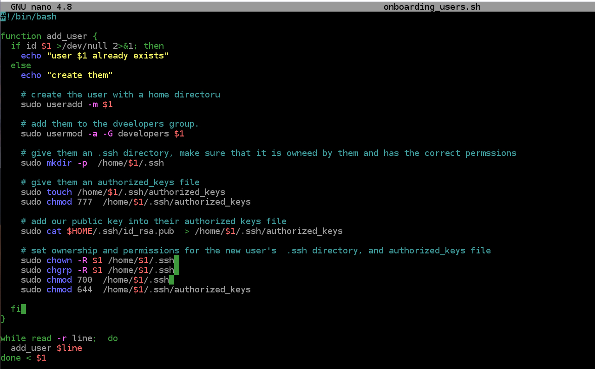
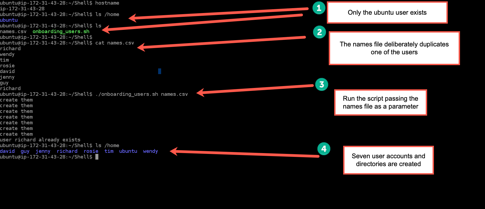
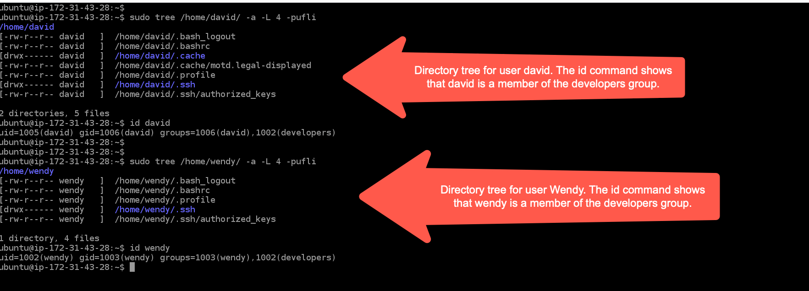
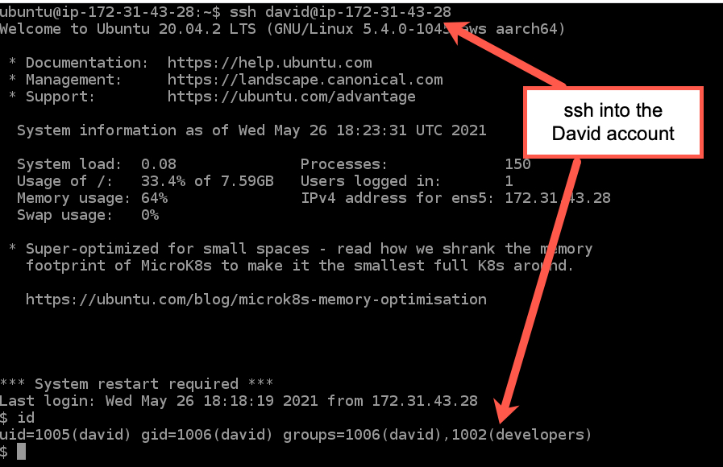
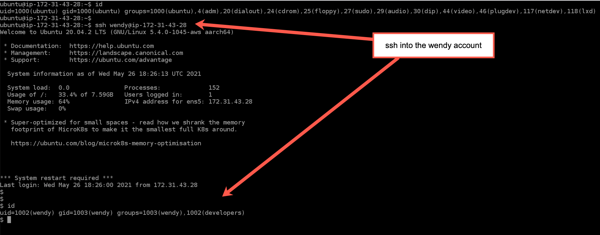
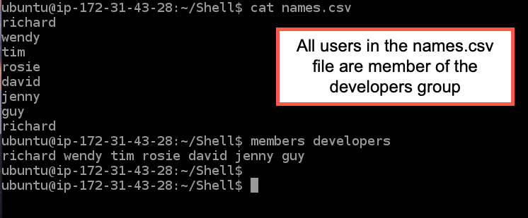

# Aux Project 1 (Shell Scripting)

1. Created an aws ubuntu ec2 instance as my server.

2. As user ubuntuu remote into the ec2 instance from my local machine.

3. sudo groupadd developers to create the developers group.

4. Created the public and private key files in $HOME/.ssh for the ubuntu user that I had logged in as

5. Set the file, and directory ownership, and permissions for $HOME/.ssh, and the files inside it.

6. Created a shell script called onborading_users.sh. It takes one parameter, the name of a csv file
   containing a list of user names. 
   
   For each username that does not already exist, create the user, and give it a home directory.

   When each users is created, additionally create and populate the $HOME/.ssh/authorized_keys file
   for that user. The authorized_keys file needs to contain the public key for the ubuntu user. 

   

7. Run the shell script, verify that all users are created, and that their home directories are created.

   

7. Test a couple of the user accounts to verify that you can login via ssh without a password because the
   ssh public keys will have been added into the auhtorized keys file for each user account when they 
   were populated.

   
   
   
   
   
      
8. All users are members of the developers group

   

