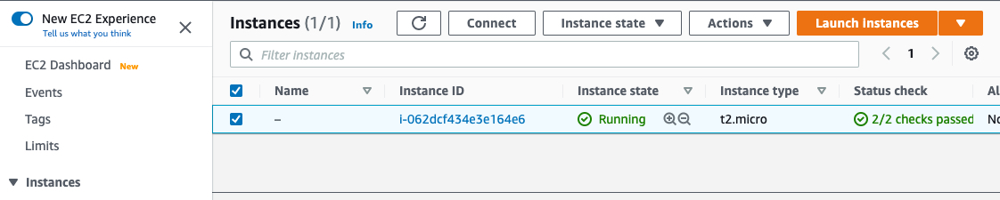
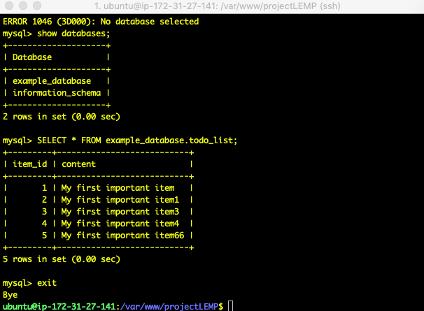
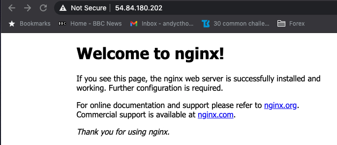
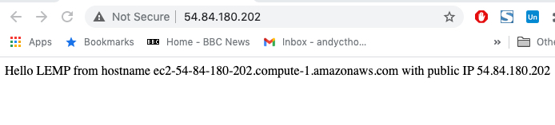
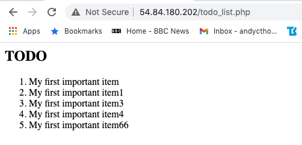

# Project 2. LEMP Webstack implmentation.

1. Created an EC2 t2 micro instance running ubuntu.
2. Enabled public / private keys so that the I could connect to the instance from my macbook.
3. Enabled port 80 in the inbound firewall rules in the security settings of the EC2 instance.
4. Installed and configured nginx web server.
5. Installed and configured mysql.
6. Installed and configured php.
7. Added a few rows of test data to the todo_list database table.
8. The screenshots below show
   1.  ubuntu ec2 instance.
   2. local ssh  session connected to the ec2 instance with sql query output.
   3. web browser showing lemp installation.
   4. web browser showing nginx installation.
   5. web browser showing successful selection of the test data.

**Ubuntu ec2 instance**

**ssh connection to ec2 instance**

**nginx installation**

**lemp installation**

**todo list**

