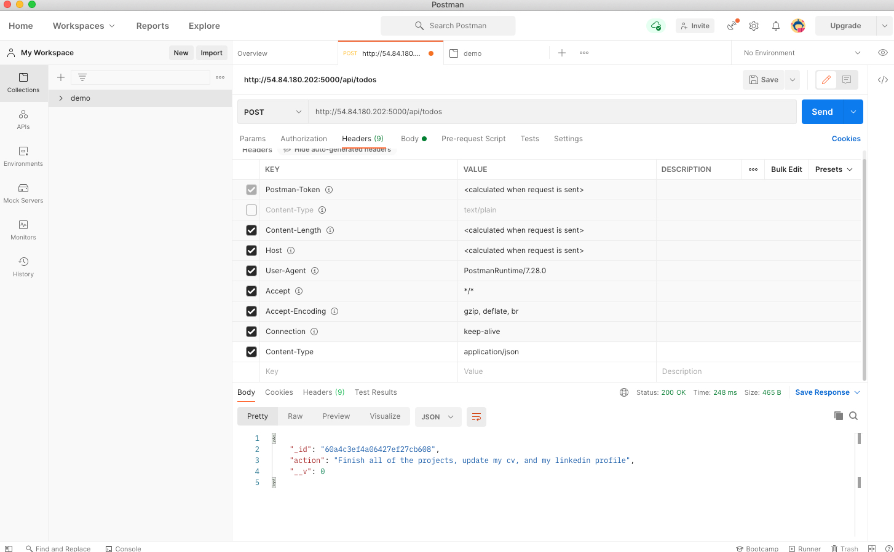
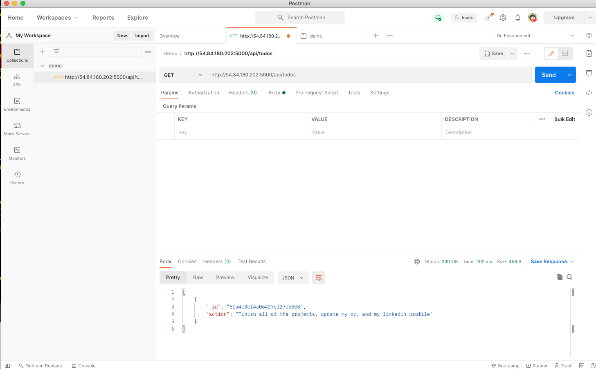
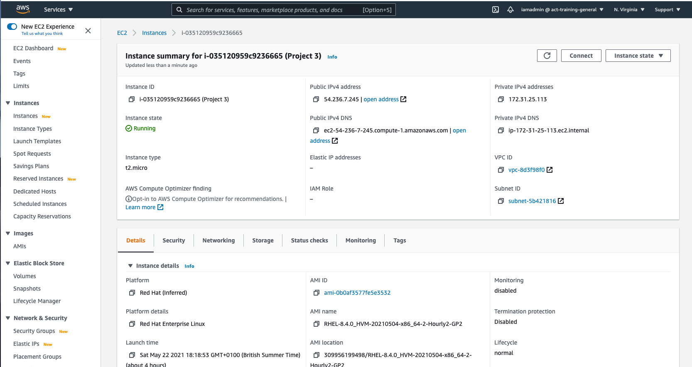
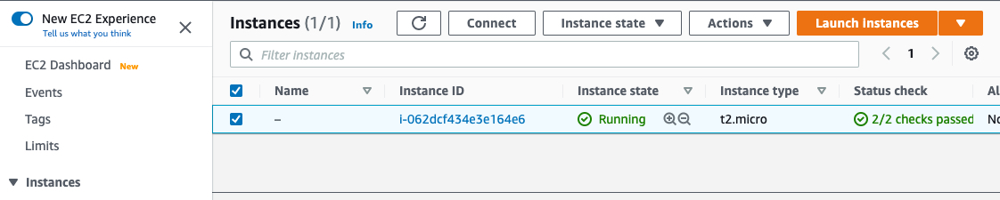
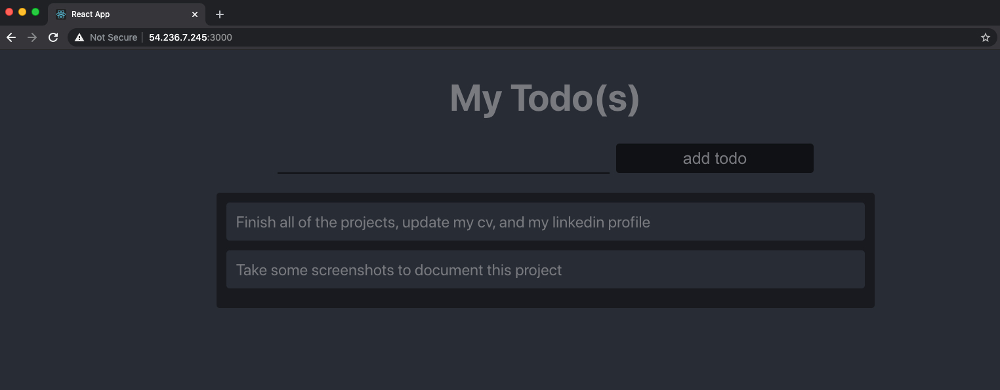

# Project 3 - MERN Stack

1. Created an aws ubuntu ec2 instance as my server.
       

2. Upgraded ubutnu on the server.

3. Installed node.js on the server.

4. Created application code in Todo directory on the server.

5. Added inbound firewall rule to expose port 5000 of the ec2 instance to the internet.

6. Installed ExpressJS and verified it's installation by viewing http://publicAddress:5000

7. Setup routes, and models directories for the application.

8. Created a mongoDb database on https://www.mongodb.com/atlas-signup-from-mlab

9. Updated configuration files to include the connection to the mongoDb database.

10. Tested the backend api using Postman

    1. Post

       

    2. Get

       

11. Attempted to create react app by running npx create-react-app client on the ubuntu
    ec2 instance. This consistently failed. Running with --verbose switch, and increasing 
    the min and max timeouts for npm activities did not make any difference.

12. Repeated steps 1 - 11 with an  aws ec2 redhat instance as my server, and not ubuntu.

       

13. Successfully ran npx create-react-app client on the redhat server. It completed in less than 2 minutes.

14. Installed https://www.npmjs.com/package/nodemon

15. Performed various other configuration steps, and created react components.

16. Installed https://github.com/axios/axios

17. Made some more changes to the js components, and style sheets.

18. Added inbound firewall rule to expose port 3000

19. npm run dev

       

20. Browser http://54.236.7.245:3000/

     