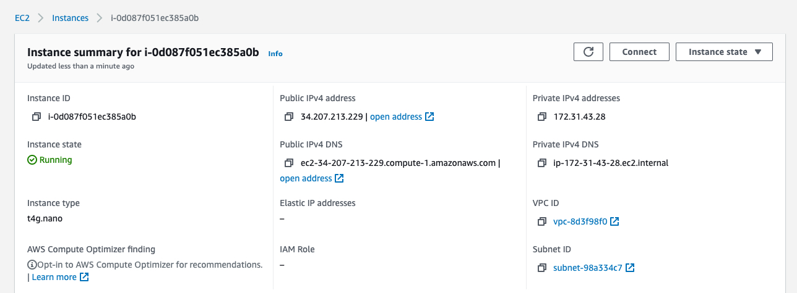
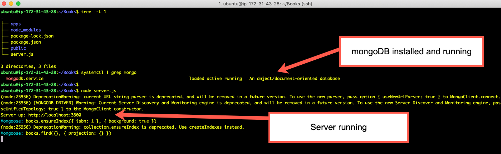
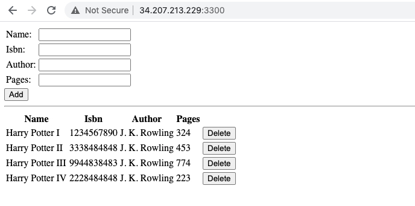

# Project 4 - MEAN Stack

1. Created an aws ubuntu ec2 instance as my server.
       

2. Upgraded ubutnu on the server.

3. Installed node.js

4. Installed mongoDB.

5. Installed express and mongoose.

6. Created and configured routes, and models.

7. Created angular controller, and site index file.

8. Added an inbound firewall rule for tcp on port 3300.

9. Checked that mongoDb was running, and start the server.
       

10. Browsed to the web page from my local machine 
       
