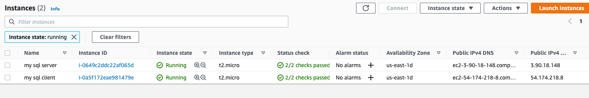
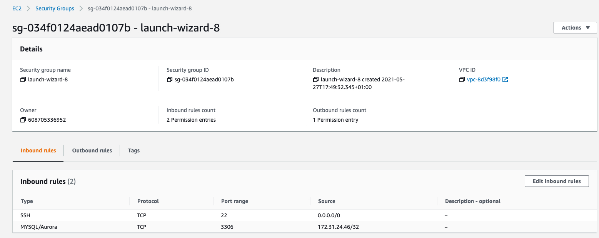
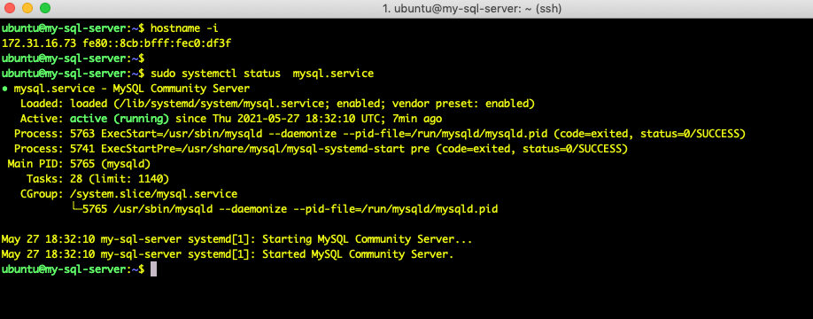
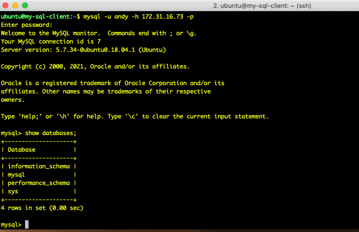

# Project 5 - Client Server

1. Create 2 ec2 instances on the same vpc and subnet. Change their names so
that one of them is msql-server, and the other one is msql-client.
       
       
2. On msql-server edit the security group to add an inbound firewall rule to allow inbound mysql traffic on port 3306
   from the private IP 4 address of the msql-client ec2 instance.
       
       
3. On msql-server ec2 instance, install msql-server, start the service, and create user 'andy' allowed to
   login from any remote host
       

4. On the msql-server  ec2 instance, install msql-client.

5. On the msql-client ec2 instance use msql to connect to the msql on the ec2 server instance
   and list the available databases.
       
       
    

