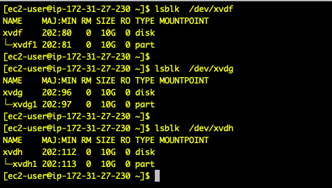

# Project 6 - Web Solution With WordPress

1. Created 2 ec2 instances running redhat linux. 

2. Attached 3 elastic block store (EBS) volumes to each ec2 instance.

3. On each ec2 instance used lsblk to verify that the new block devices were avaiable.

4. On each ec2 instance used gisk to creeate a single partion on each of the 3 disks for that ec2 instance.
  

5. Used lsblk to verify that the new partitions were available.
  

6. On each ec2 instance used pvcreate to mark each of the 3 disks as physical volumes.

7. Designated one of the ec2 instances to be a webserver, and the other a database server.

8. On the webserver instance used vgcreate to add all of the physical volumes  to a volume group called webdata-vg.
   Then used lvcreate to create 2 logical volumes each of them being half the size of the physical volume. One lv
   has app data, and the other has log files.

9. On the database server instance used vgcreate add all of the physical volumes to a volume group all dbdata-vg.
   Then used lvcreate to create 2 logical volumes each of them being half the size of the physical volume. One lv
   has database data, and the other has log files.
   
10. Verify the entire setup of volumes on both instances. Used mkfs.exta to format the logical volumes with ext4
   filesystems on both instances.
       

       
   
11. Created directories for web site files, and log files on the webserver, and similarly for database files   
   and log files on the database server.
   

12. Mounted all of the volumes, and included them in fstab so that they would still be there when the instances
    were re-booted.
    
13. Installed, and configured apache web server on the web server instance.
       

14. Installed and configured mysql-server on the database server instance.
       

15. Installed and configured wordpress on the web server instance.

16. Added inbound firewall rules on the database server so that the web server could connect to the database.

17. Added inbound firewall rule on the web server so that I browse to it from my local macbook.

18. Installed mysql lcient on the web server so that I could verify that the web server / db server connections
    were set-up correctly for database access from the web server.
    
19. Started everything up, and browsed to the word press site from my browser. It failed the first time 
    because I had not correcty updated the wp-config.php file. Once I had resolved that issue everything worked correctly.
       

       
